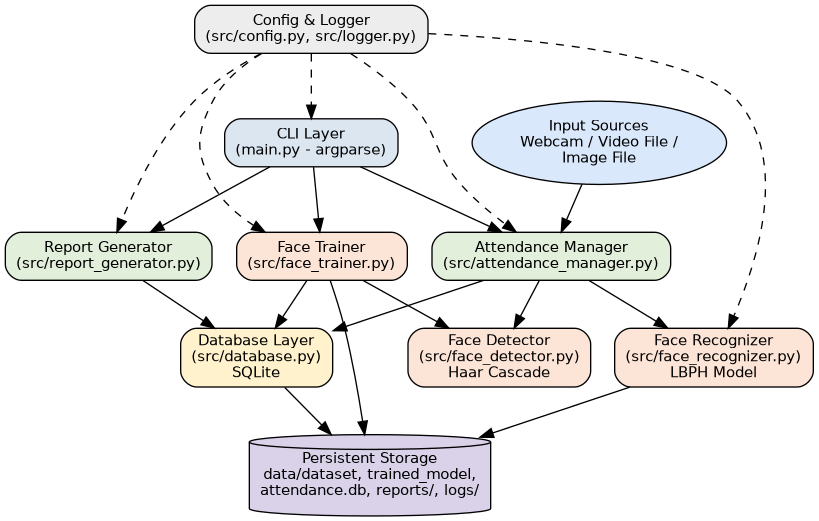
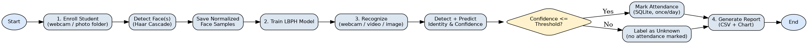
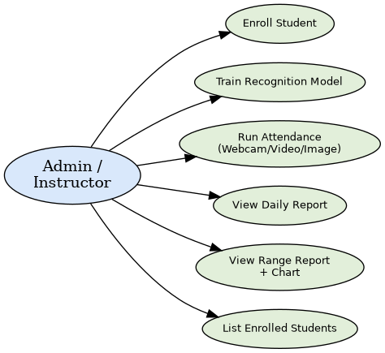
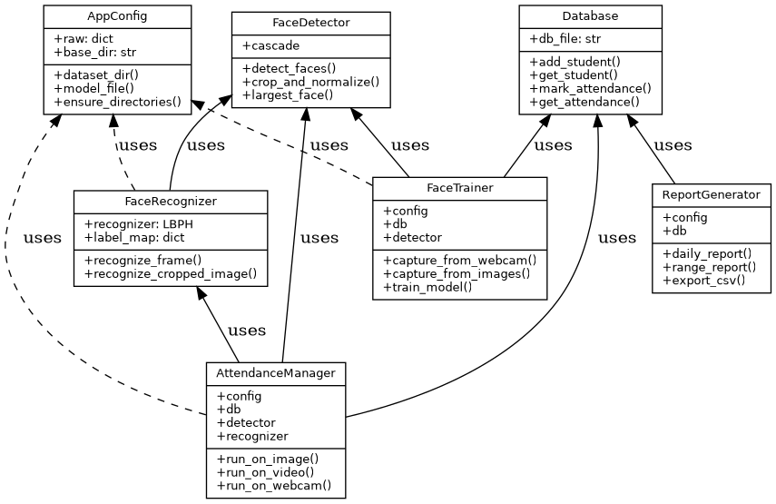
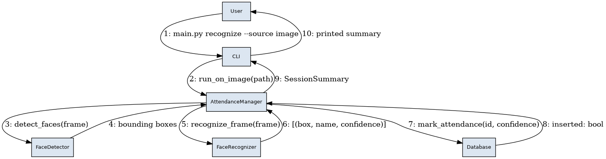
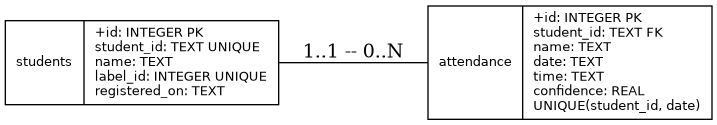

# Design & Architecture Documentation

This document contains the system architecture, workflow, and UML diagrams
for the **Face Recognition Attendance System**, as required by the
project's design-documentation deliverables. The same content, expanded
with rationale, appears in the PDF project report submitted separately.

---

## 1. System Architecture

The system is organized into clean, single-responsibility layers: a CLI
layer for user interaction, an orchestration layer (`AttendanceManager`)
that coordinates computer-vision components, the CV components
themselves (detector / trainer / recognizer), a persistence layer
(SQLite), and a reporting layer. Configuration and logging are
cross-cutting concerns injected into every layer.



**Layers**

| Layer | Module(s) | Responsibility |
|---|---|---|
| CLI | `main.py` | Parses commands/arguments, calls the right handler, prints results |
| Orchestration | `src/attendance_manager.py` | Runs the detect → recognize → mark-attendance loop over webcam/video/image input |
| Enrollment/Training | `src/face_trainer.py` | Builds the labeled face dataset and trains the LBPH model |
| Detection | `src/face_detector.py` | Haar-cascade face localization + normalization |
| Recognition | `src/face_recognizer.py` | LBPH inference (identity + confidence) |
| Persistence | `src/database.py` | SQLite schema, CRUD, attendance de-duplication |
| Reporting | `src/report_generator.py` | CSV export + matplotlib chart generation |
| Cross-cutting | `src/config.py`, `src/logger.py`, `src/exceptions.py` | Configuration, logging, structured error handling |

---

## 2. Workflow / Process Flow



1. **Enroll** a student either from a live webcam session or from a
   folder of existing photographs.
2. Detected faces are cropped, converted to grayscale, histogram
   equalized, and resized to a fixed size, then saved as training
   samples.
3. **Train** the LBPH recognizer on every sample belonging to every
   enrolled student; the model and a label→identity map are persisted
   to disk.
4. **Recognize**: for each frame from a webcam/video/image, detect
   faces, predict identity + confidence for each, and mark attendance
   in SQLite for any face whose confidence is within the configured
   threshold (once per day per student).
5. **Report**: query attendance from SQLite and export a CSV plus a
   bar chart of attendance counts.

---

## 3. Use Case Diagram



A single actor (Admin/Instructor, or a self-service kiosk operator)
drives all six use cases through the CLI.

---

## 4. Class Diagram



Dependency direction is deliberately one-way: `AttendanceManager` and
`FaceTrainer` depend on `FaceDetector`/`FaceRecognizer`/`Database`, never
the reverse — this keeps the CV components independently testable (see
`tests/test_face_detector.py`, `tests/test_pipeline_integration.py`).

---

## 5. Sequence Diagram — Recognize & Mark Attendance



This is the critical path exercised by `python main.py recognize
--source image --path <file>`: CLI → AttendanceManager → FaceDetector →
FaceRecognizer → Database → back up the chain to a printed summary.

---

## 6. Database Design (ER Diagram + Schema)



```sql
CREATE TABLE students (
    id            INTEGER PRIMARY KEY AUTOINCREMENT,
    student_id    TEXT UNIQUE NOT NULL,
    name          TEXT NOT NULL,
    label_id      INTEGER UNIQUE NOT NULL,   -- maps to the LBPH numeric label
    registered_on TEXT NOT NULL
);

CREATE TABLE attendance (
    id          INTEGER PRIMARY KEY AUTOINCREMENT,
    student_id  TEXT NOT NULL,
    name        TEXT NOT NULL,
    date        TEXT NOT NULL,
    time        TEXT NOT NULL,
    confidence  REAL NOT NULL,
    FOREIGN KEY (student_id) REFERENCES students(student_id),
    UNIQUE(student_id, date)                  -- enforces "once per day"
);
```

The `UNIQUE(student_id, date)` constraint is what makes
`mark_attendance()` idempotent — a second recognition of the same
person on the same day fails the insert with `IntegrityError`, which
`Database.mark_attendance()` catches and turns into a normal "already
marked" outcome instead of a duplicate row.

---

## 7. Dataset & Model Notes

- **Detection**: OpenCV's bundled Haar Cascade
  (`haarcascade_frontalface_default.xml`) — chosen over a DNN detector
  so the project has zero external model downloads and runs fully
  offline/CPU-only, which matters for a CLI tool that must be
  reproducible in any evaluator's environment.
- **Recognition**: OpenCV-contrib's LBPH (Local Binary Patterns
  Histograms) face recognizer — a classical, lightweight, interpretable
  algorithm well suited to a small enrolled-student gallery, and it
  trains in milliseconds on CPU with no GPU dependency.
- **Dataset**: this repository intentionally ships **no real face
  photographs** (biometric data of real people should not be committed
  to a public repository). Instead:
  - `scripts/generate_synthetic_faces.py` procedurally draws simple,
    privacy-safe placeholder face images so the *pipeline* (enroll →
    train → recognize → report) can be exercised end-to-end without a
    webcam, and is what `tests/test_pipeline_integration.py` uses.
  - Real usage enrolls actual students via `--source webcam` or a
    folder of the user's own photos (`--source images`).
  - `--cropped` mode additionally supports pre-cropped benchmark face
    datasets (e.g. ORL/AT&T Faces) for experimentation.
- **Evaluation methodology**: `recognition.confidence_threshold` in
  `config.yaml` controls the accept/reject boundary (LBPH distance —
  lower is a better match). Predictions above the threshold are
  reported as `Unknown` rather than forced onto the nearest label,
  trading a small amount of recall for a much lower false-accept rate,
  which is the right trade-off for an attendance/access-style system.
